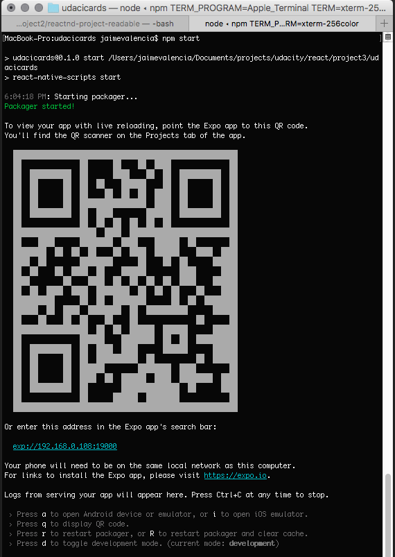
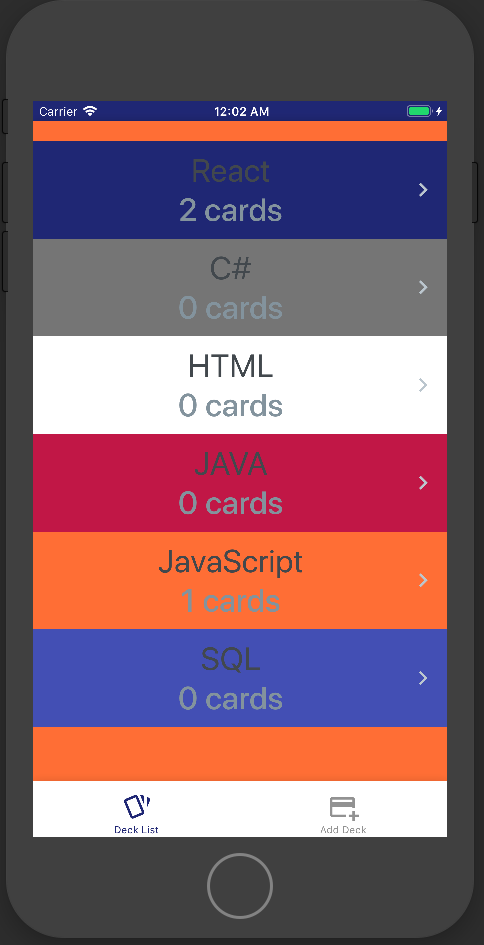
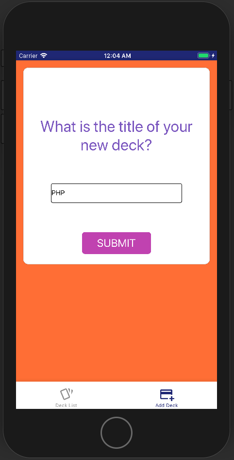
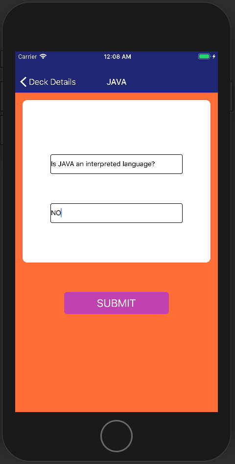
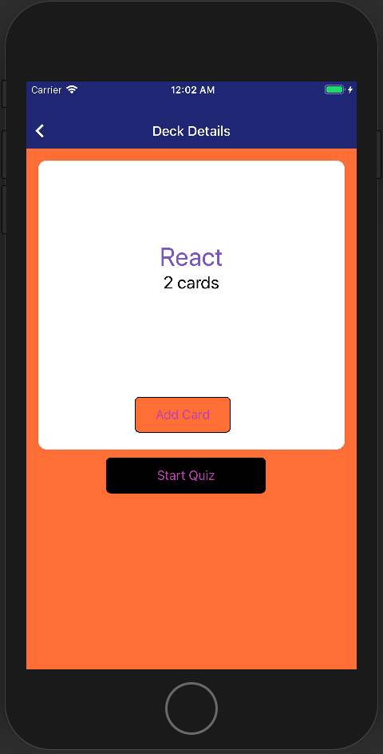
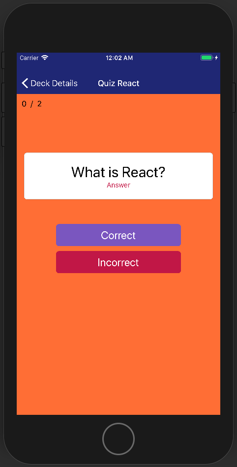
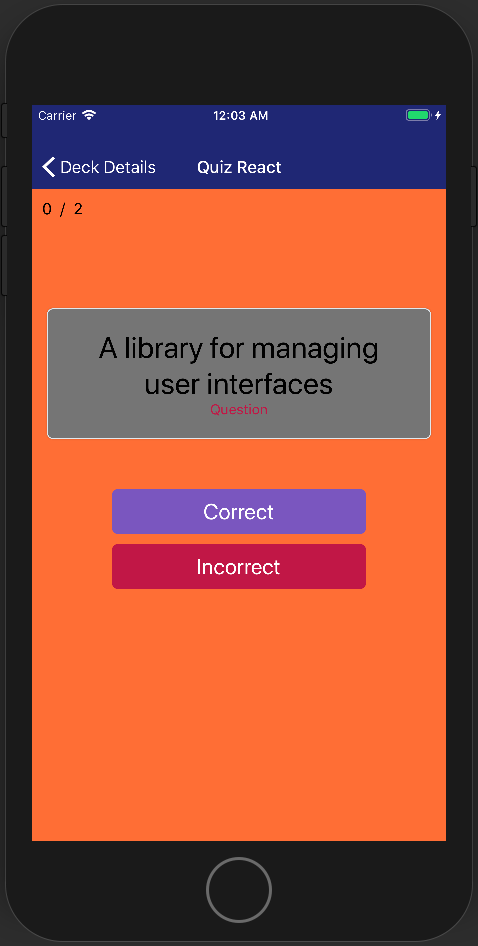
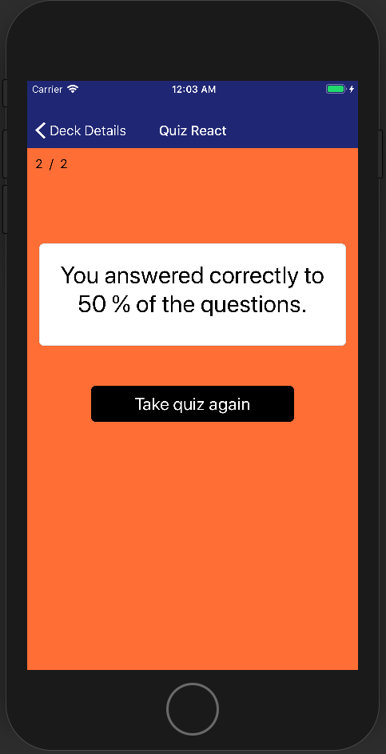

# Readable
---

## Project:

Third project for REACT Udacity nanodegree. Shows how to use react - native.

Mobile application (Android or iOS - or both) that allows users to study collections of flashcards. The app will allow users to create different categories of flashcards called "decks", add flashcards to those decks, then take quizzes on those decks.

## How to...
The project uses Node.js and the "Project Readable API Server" project as server using 3001 port.  You MUST have NODEJS installed already in your computer

Go to the directory where you want to store the app (Terminal)
```
git clone https://github.com/vaduinc/reactnd-project-udacicards.git
```
Go to the applicaton folder and run the commands
```
npm install
npm start

You will see some options (similar to the following screenshot)
Then you can select "a" for Android or "i" for IPhone
```



You will then see the application running in your device or emulator (depending whether you have your device connected to your computer)
Navigate the application using the following descriptions from the main page, see next picture.
<br>
Home page lists all the existing decks created by the user (first time will have 2 by default).
User can select any existing deck just by clicking/touching the item in the list.



```diff
```
## New Deck
At the bottom of the main page, the user will have the option to create new decks (Add Deck)



```diff
```
## Add cards/question to a Deck
User can add as many cards hi/she wants to any given deck.
Just type the question/answer and the submit button will display.



```diff
```
## Take Quiz 
While in the Deck Details, the user can add or start a quiz if there 
are any cards.



```diff
```

## Question
Each question is presented with a link/button to the "answer"
that the user can click/touch to see the back of the card (answer)



## Answer
Each answer has a link/button to get back to the "question"



## Results
At the end of the quiz, there is a result page showing the %
of correct answers. Also there is "take quiz again" button to start the
quiz again.



## NOTES:

This application was tested in a IPHONE emulator and a HTC Android device.

### Resources:
* [Project UdaciFitness API Server](https://github.com/udacity/reactnd-UdaciFitness-complete)
* [Icon images](https://expo.github.io/vector-icons/)
* [FlatList Component — React Native Basics](https://medium.com/react-native-development/how-to-use-the-flatlist-component-react-native-basics-92c482816fe6)